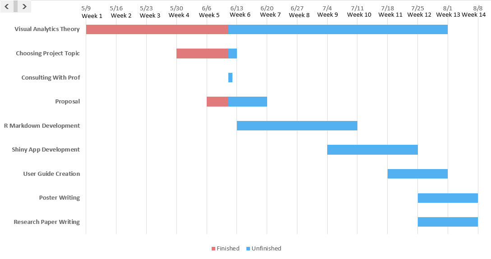
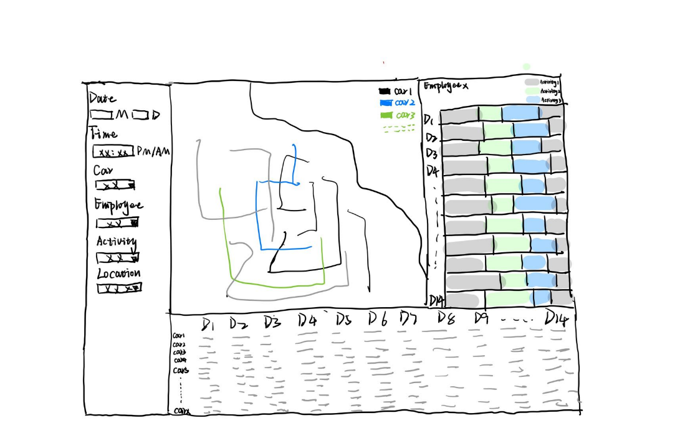

```{r setup, include=FALSE}
knitr::opts_chunk$set(echo = FALSE)
```


## Motivation

In challenge 2 we have two weeks vehicle tracking data of the employees and their credit card and loyalty card transactions data. These datasets combine geospatial data with aspatial information and time information which allow us to use geospatial analysis and time-series analysis.

Our analysis will link these data through both geospatial and time analysis. We will try to identify suspicious patterns of behavior, involved locations and people.

## Objectives

The project aims to deliver an R-Shiny app that provides:

1. Interactive user interface design.
2. Vehicle tracking information and all locations interfaced with a visual map representation.
3. A visual timeline representation for each car with corresponding classified location types by different color.
4. A visual timeline representation for cars with their activity and stop information.

## Proposed Scope and Methodology

1. Analysis of dataset with background search and assumption making.

2. Overview spatial map:

  An overview map combined with tracking data colored by car&#39;s ID will be used to detect low frequency state occurred.

3. Cluster analysis:

  Among the grouped employee with similar consumption feature to find the unusual activities compared with others.

4. Gannet chart:

Show the all-day movement status (blank means stop and colored line means moving) for each car, to compare the movement pattern to find the possible suspicious activity.

5. Calendar chart:

  Present daily time distribution of each employee and color chart in terms of different activity categories to see abnormal activities.

6. Spatial-temporal analysis

  Aim to realize the analysis across both space and time at the same time. Support viewers created automatic proximity detection with a user definable space and a time window.

7. Edit proposal and process by R Markdowns.

8. Utilize R-shiny app to achieve user interactivities.

## Timeline



A generalized development timeframe for this project is shown below.

## Prototypes




